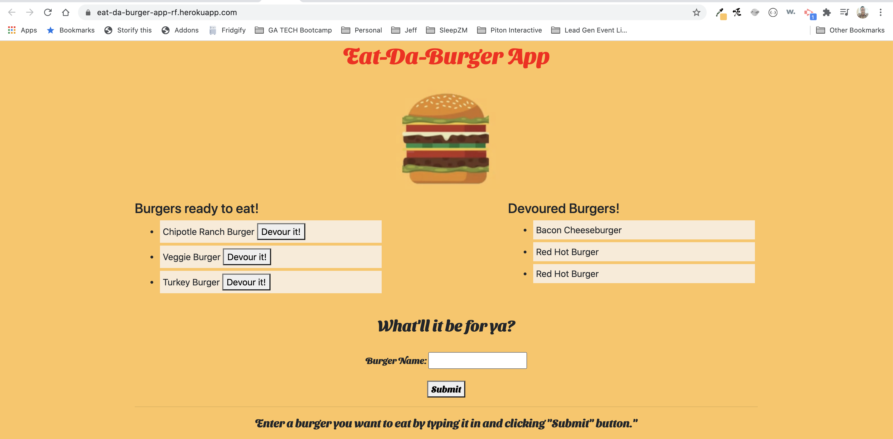
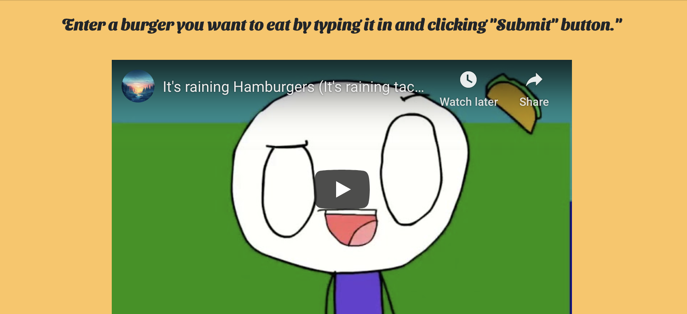
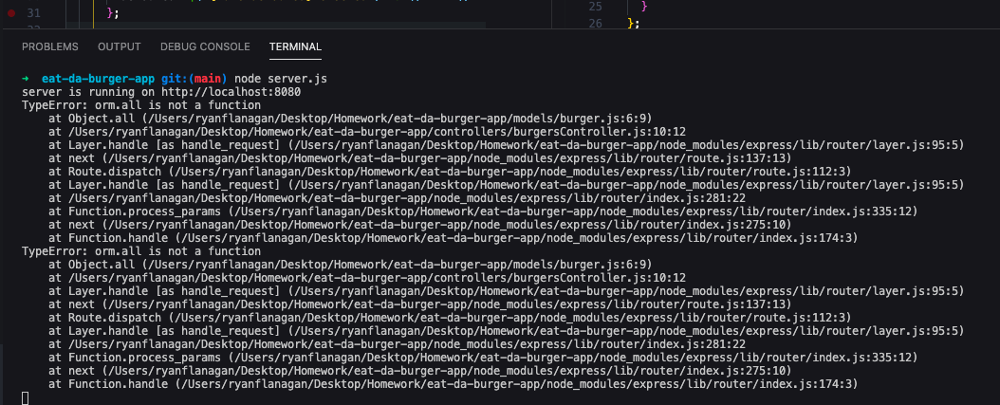
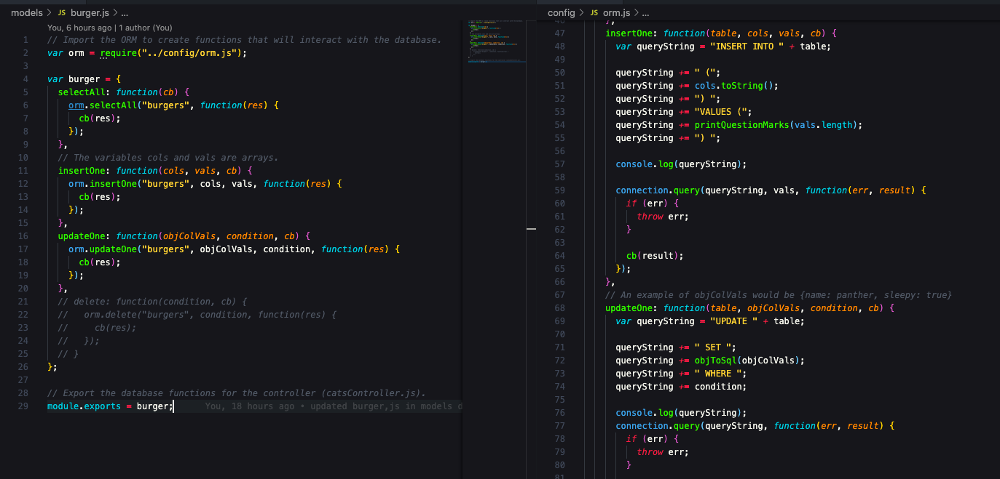

# eat-da-burger-app

## Description
This is  burger logger app with MySQL, Node, Express, Handlebars and a homemade ORM (yum!). It follows the MVC design pattern; uses Node and MySQL to query and route data, and Handlebars to generate the HTML.

## Deployed Application Link

This application is deployed on Heroku.

[Enjoy the feast by visiting here...](https://eat-da-burger-app-rf.herokuapp.com/)

## Contents

This application contains an MVC based file structure design which contains the following:

*   [config] containing the connection.js and orm.js files
*   [controllers] containing the burgersController.js file
*   [db] containing the schema.sql and seeds.sql files
*   [models] containing the burger.js file
*   [public] containing the assets directory which holds the style.css, images related to this application and the instructions.md file. It also holds the burgerCRUD.js file under the js folder.
*   [views] containing all handlebars layouts and front-end elements.
*   [package.json] along with the package-lock.json
*   [server.js] containing the server build code.

## Application Requirements

These are referenced within the [instructions.md.](public/assets/instructions.md)

## Usage Information

MySQL, NodeJS, Express, Handlebars were required to build this application as well as creating a custom ORM.

Once you click on the Heroku link above to access it. You'll be able to add burgers to a list of un-eaten burgers. Once you click "Devour It!" then it will be moved to a devoured column. 

For a fun addition to this application, users can play "It's raining hamburgers" from an embedded YouTube video as shown here...

## Challenges / Credits & Contributions

Initially I had difficulties setting up my JAWSDB_URL table in MySQL workbench; specifically setting the Current Timestamp to default. However with gaining more familiarity on the MySql dashboard - and with the assistance of classmates Jada Arnett and Brandon Walker, I was able to get it working.

On 10-9-2020, TAs, Phil Simmons and Christina Starr helped me troubleshoot my path mapping my burgerCRUD.js file to my index.handlebars as I was showing 404 errors. My 

    app.use(express.static("public"));

was being implemented in my server.js but it was that my relative paths in the index.handlebars file wasn't right.

During the build I also had some mapping issues between the orm.js, burger.js, burgerCRUD.js and burgersController.js as shown here

With TA - Peter Colella's help doing some double checking on my const variables and function names, I need to keep the method name syntax the same across them.

## Resources

* [Handlebars Partials](https://handlebarsjs.com/guide/#partials)
* [Handlebars #Unless](https://handlebarsjs.com/guide/builtin-helpers.html#unless)
* [What is ORM? - How to roll-your-own-JavaScript ORM](https://jarednielsen.com/object-relational-mapping-javascript-orm/)

## Badge

## License
Copyright 2020 - Ryan Flanagan

Permission is hereby granted, free of charge, to any person obtaining a copy of this software and associated documentation files (the "Software"), to deal in the Software without restriction, including without limitation the rights to use, copy, modify, merge, publish, distribute, sublicense, and/or sell copies of the Software, and to permit persons to whom the Software is furnished to do so, subject to the following conditions:

The above copyright notice and this permission notice shall be included in all copies or substantial portions of the Software.

THE SOFTWARE IS PROVIDED "AS IS", WITHOUT WARRANTY OF ANY KIND, EXPRESS OR IMPLIED, INCLUDING BUT NOT LIMITED TO THE WARRANTIES OF MERCHANTABILITY, FITNESS FOR A PARTICULAR PURPOSE AND NONINFRINGEMENT. IN NO EVENT SHALL THE AUTHORS OR COPYRIGHT HOLDERS BE LIABLE FOR ANY CLAIM, DAMAGES OR OTHER LIABILITY, WHETHER IN AN ACTION OF CONTRACT, TORT OR OTHERWISE, ARISING FROM, OUT OF OR IN CONNECTION WITH THE SOFTWARE OR THE USE OR OTHER DEALINGS IN THE SOFTWARE.

